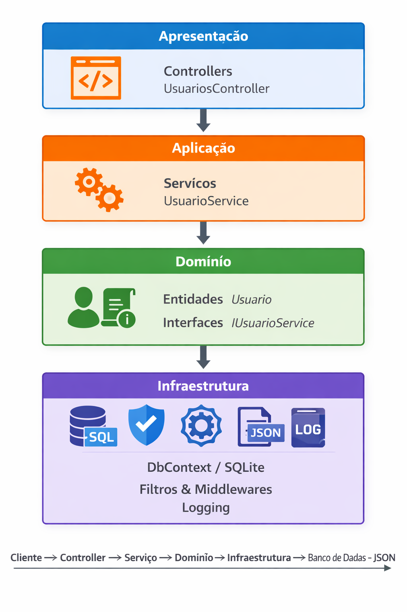

# 📄 API Gestão de Usuários

## 🚀 Visão Geral
Esta é uma **API RESTful** desenvolvida em **ASP.NET Core (.NET 8)** para gestão de usuários.  
Ela utiliza **SQLite** como banco de dados, **Swagger** para documentação interativa e **Bogus** para geração de dados fictícios em cenários de teste.

---

## 🛠️ Tecnologias Utilizadas
- [.NET 8](https://dotnet.microsoft.com/)  
- [Entity Framework Core](https://learn.microsoft.com/ef/) com **SQLite**  
- [Swagger / Swashbuckle](https://swagger.io/) para documentação da API  
- [Serilog](https://serilog.net/) para logging estruturado  
- [Bogus](https://github.com/bchavez/Bogus) para geração de dados fake  

---

## 📂 Estrutura do Projeto
- **Controllers** → Endpoints da API (`UsuariosController`)  
- **Domain** → Entidades e interfaces de negócio  
- **Services** → Lógica de aplicação (`UsuarioService`)  
- **Infraestrutura** → Filtros, middlewares, serialização, DbContext  

---

## ⚙️ Configuração

### 1. Pré-requisitos
- Instalar o **.NET 8 SDK**  
- Instalar o **SQLite** (ou usar o provider embutido)  

### 2. Clonar o repositório
```bash
git clone https://github.com/seu-repo/api-gestao-usuarios.git
cd api-gestao-usuarios
```
### 3. Configurar appsettings.json
```
{
  "ConnectionStrings": {
    "DefaultConnection": "Data Source=gestaoUsuarios.db"
  },
  "CorsSettings": {
    "AllowedOrigin": "https://brunotrbr.github.io"
  }
}
```
### 4. Criar o banco de dados
dotnet ef database update

### 5. Executar a aplicação
dotnet run

## A API estará disponível em:

- https://localhost:7000 (HTTPS)

- http://localhost:5231 (HTTP)

### 📖 Documentação
O Swagger estará disponível em:

 - http://localhost:5231/swagger

- https://localhost:7000/swagger

## 🧪 Endpoints Principais
### Criar Usuário
http
POST /api/v1/GestaoUsuarios/usuario
Content-Type: application/json
```
{
  "nome": "João Silva",
  "email": "joao@email.com",
  "senha": "123456"
}
```
### Buscar Usuário por ID
http
GET /api/v1/GestaoUsuarios/Usuario/{id:guid}

### Buscar Usuário por Email
http
GET /api/v1/GestaoUsuarios/Usuario/{email}

### Atualizar Usuário
http
PATCH /api/v1/GestaoUsuarios/Usuario/atualizar/{id:guid}
Content-Type: application/json
```
{
  "nome": "João Atualizado",
  "email": "joao.novo@email.com"
}
```

### Desativar Usuário
http
PATCH /api/v1/GestaoUsuarios/Usuario/desativar/{id:guid}


### Gerar Usuários Fake (Bogus)
http
GET /api/v1/GestaoUsuarios/UsuariosFake?quantidade=20

### Operação Autenticada
http
POST /api/v1/GestaoUsuarios/operacao-autenticada
Content-Type: application/json
```
{
  "email": "joao@email.com",
  "senha": "123456"
}
 ```
### Operação para Apagar todos os registros do Banco de Dados
 Delete {{ApiGestaoUsuarios_HostAddress}}/api/v1/GestaoUsuarios/ApagarTodosRegistros


## 🏗️ Arquitetura da Solução
### Camadas
- Apresentação (Controllers) → expõem endpoints HTTP.

- Aplicação/Serviços → lógica de negócio (UsuarioService).

- Domínio → entidades e interfaces (Usuario, IUsuarioService).

- Infraestrutura → persistência (EF Core), filtros, middlewares, serialização, logging.

### Cross-Cutting Concerns
- Filtros Globais: ValidationFilter, AuditFilter.

- Middlewares: ExceptionHandlingMiddleware, ResponseWrapperMiddleware.

- Serialização JSON: SnakeCaseNamingPolicy, DateTimeConverter, ignorar valores nulos.

### Fluxo Simplificado
```
Cliente → Middleware (ExceptionHandling / ResponseWrapper)
       → Filtros (Validation / Audit)
       → Controller (UsuariosController)
       → Serviço (UsuarioService)
       → DbContext (EF Core / SQLite)
       → Retorno JSON padronizado → Cliente
```

## ✅ Benefícios da Solução
- Contrato JSON coerente e padronizado

- Validação automática com filtros globais

- Auditoria de requisições com logs estruturados

- Documentação interativa via Swagger

- Geração de dados fake para testes com Bogus

- Separação clara de responsabilidades em camadas

## 📌 Observações
- O projeto já está preparado para CORS, permitindo apenas origens configuradas no appsettings.json.

- Logs são gravados em console e em arquivo (logs/log.txt) com rotação diária.

- Middlewares garantem tratamento global de exceções e padronização das respostas.

## 🔒 Proteção de Senhas

A aplicação implementa um mecanismo seguro para armazenamento e validação de senhas:

- As senhas **não são persistidas em texto puro** no banco de dados.
- Utilizamos o `IPasswordHasher` da biblioteca **ASP.NET Core Identity**, que aplica algoritmos de hashing com salt interno.
- O serviço responsável por isso é o `PasswordService`, que:
  - **Hash**: gera um hash seguro da senha informada antes de salvar.
  - **Verify**: compara a senha fornecida com o hash armazenado, sem nunca expor o valor original.
- Exemplo simplificado:
```csharp
  public string Hash(string username, string password)
  {
      return _hasher.HashPassword(username, password);
  }

  public bool Verify(string username, string storedHash, string providedPassword)
  {
      var result = _hasher.VerifyHashedPassword(username, storedHash, providedPassword);
      return result != PasswordVerificationResult.Failed;
  }
```

## 🏗️ Diagrama de Camadas da Arquitetura

Abaixo está a representação visual das camadas da aplicação:



Fluxo:  
Cliente → Controller → Serviço → Domínio → Infraestrutura → Banco de Dados → JSON

## 🧾 Logs Básicos de Execução

A aplicação utiliza **Serilog** para registrar logs estruturados durante a execução, garantindo rastreabilidade e auditoria das operações.

### 📋 Configuração
Os logs são configurados no `Program.cs` e armazenados em:
- **Console** (para visualização em tempo real durante o desenvolvimento)
- **Arquivo** (`logs/log.txt`) com rotação diária

Exemplo de configuração:
```csharp
Log.Logger = new LoggerConfiguration()
    .WriteTo.Console()
    .WriteTo.File("logs/log.txt", rollingInterval: RollingInterval.Day)
    .CreateLogger();
```

🧠 Tipos de Logs Registrados
Informações gerais: inicialização da aplicação, endpoints acessados, tempo de resposta.

Avisos (Warning): comportamentos inesperados, mas não críticos.

Erros (Error): exceções capturadas pelo ExceptionHandlingMiddleware.

Auditoria (Audit): requisições e respostas monitoradas pelo AuditFilter.